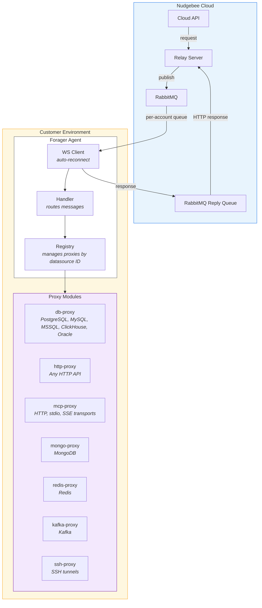

# Forager Architecture

Forager is a lightweight agent that runs in customer environments (VMs, containers) and proxies requests from Nudgebee's cloud platform to customer datasources (databases, HTTP APIs, MCP servers, etc.). Customers never need to expose their datasources to the internet.

## Documentation

- [Connection Lifecycle](connection-lifecycle.md) — startup, WebSocket handshake, auto-reconnect, config sync
- [Request Flow](request-flow.md) — how requests route from cloud to datasource and back, message formats
- [Proxy Modules](proxy-modules.md) — all proxy types, transports, auth patterns
- [Configuration](configuration.md) — forager.yaml, environment variables, credential management
