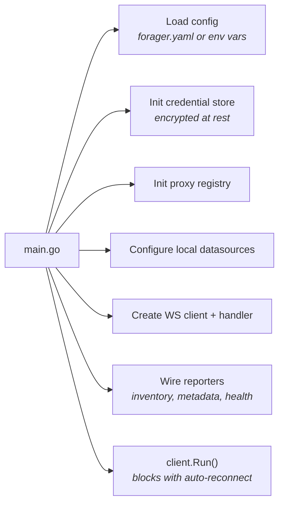
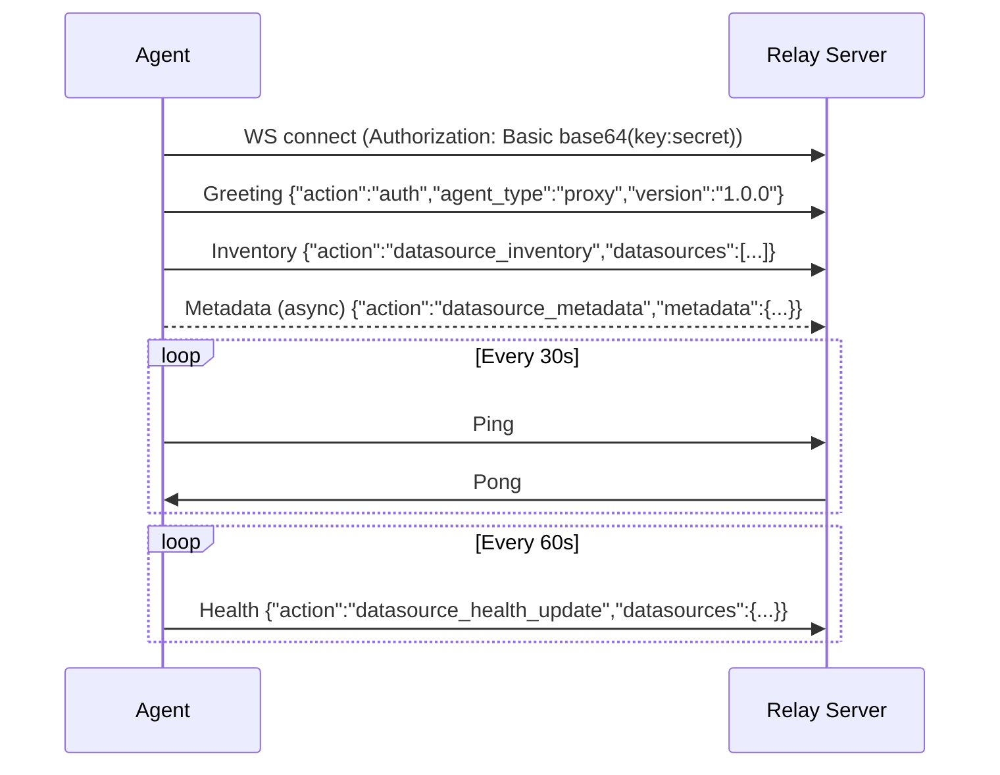
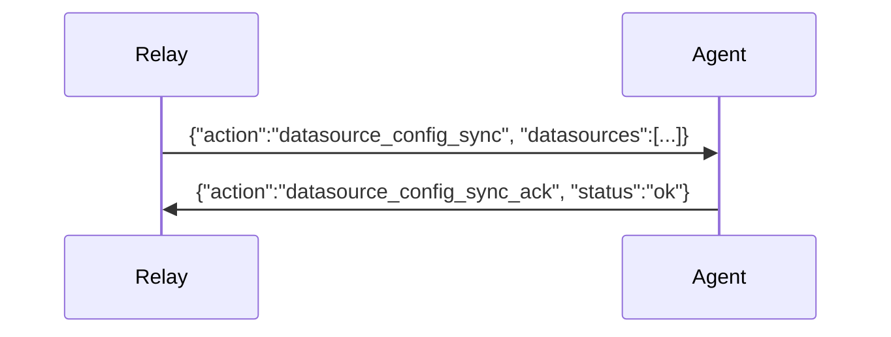
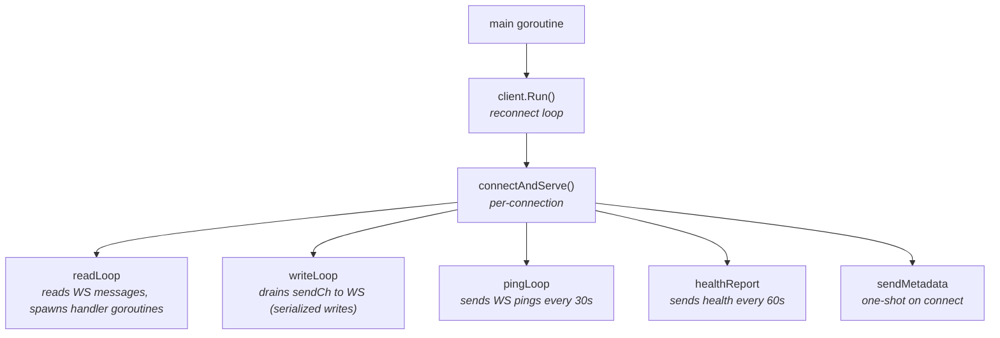

# Connection Lifecycle

## Startup

## WebSocket Connection

The agent initiates an outbound WebSocket connection to the relay server. The relay never connects inbound to the agent.

**Auto-reconnect:** On disconnect, the agent reconnects with exponential backoff (3s → 6s → 12s → ... → 30s max).

## Config Sync

The cloud can push datasource configurations at any time via WebSocket:

Each datasource in the sync includes:
- `id`, `type`, `proxy_type`, `name`
- `config` — transport-specific settings (host, port, URL, etc.)
- `credentials` — auth credentials (or reference to secret provider)
- `credential_source` — where creds come from: `cloud_push`, `local`, `aws_secrets_manager`, etc.

The handler creates/reconfigures proxy instances and removes any datasources not in the new config.

## Concurrency Model

Each incoming request is handled in its own goroutine (spawned by readLoop). Proxy modules manage their own connection pools. The WS write path is serialized through a buffered channel (capacity 64).
