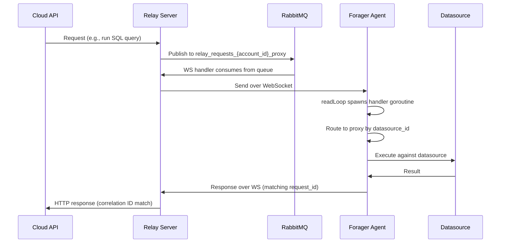

# Request Flow

## Cloud → Agent → Datasource → Agent → Cloud



## Message Routing

```go
// handler.go — HandleMessage
switch {
case action == "datasource_config_sync":
    → handleConfigSync()        // Reconfigure all proxies

case datasource_id != "":
    → handleRequest()           // Unified path: route by datasource_id
    → works for all proxy types (DB, HTTP, MCP, etc.)

case datasource_id == "":
    → handleLegacyRequest()     // Backward compat for old message formats
}
```

## Unified Request Format

All requests use a single format with explicit datasource routing:

```json
{
  "request_id": "abc-123",
  "datasource_id": "local:my-postgres",
  "action": "run_query",
  "params": {
    "query": "SELECT version()"
  }
}
```

For HTTP proxy requests (Grafana, Prometheus, custom APIs):

```json
{
  "request_id": "abc-123",
  "datasource_id": "local:my-grafana",
  "action": "http_request",
  "method": "GET",
  "url": "/api/v1/query?query=up",
  "header": {"Authorization": ["Bearer token"]},
  "body": ""
}
```

The relay server wraps HTTP requests in unified format when the caller provides `X-NB-Datasource-ID` header. Legacy formats (without `datasource_id`) are still supported via fallback routing.

## Response Format

All responses follow this structure:

```json
{
  "request_id": "abc-123",
  "status_code": 200,
  "data": "..."
}
```

## Relay Server Integration

The relay server converts requests for proxy agents based on the `X-NB-Datasource-ID` header:

| Header present? | Agent type | Behavior |
|-----------------|-----------|----------|
| Yes | proxy | Wraps in unified format with `datasource_id` |
| No | proxy | Sends raw format, forager uses legacy fallback |
| Any | k8s | No change, sends original format |

Affected relay handlers: `grafana.go`, `api.go`. The `request.go` handler (ExternalActionRequest) is unchanged — forager's legacy handler extracts `datasource_id` from `action_params`.
